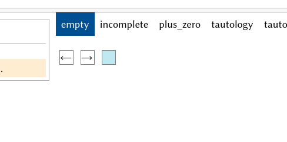
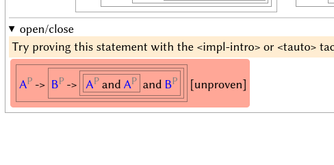
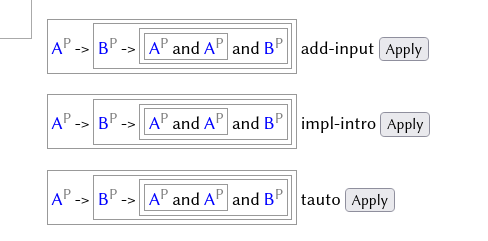
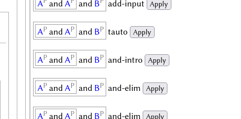
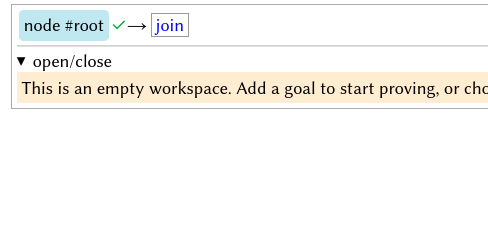
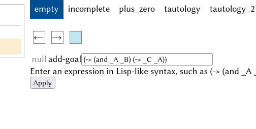
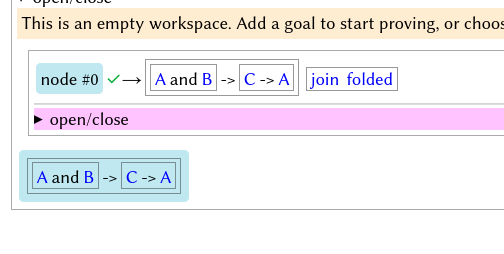
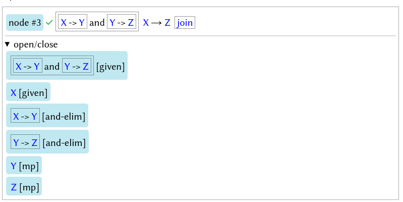
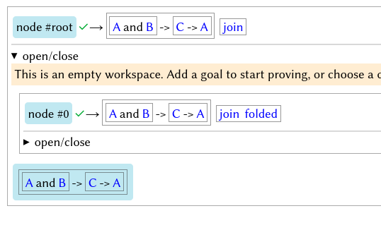

Saphyra 2024 Spring Report
===

[__Saphyra__](https://github.com/pennzht/saphyra) is a proof assistant under development, with simplicity and user-friendliness as goals. As of April 1, 2024, it is able to verify some simple statements about natural numbers and automatically prove (propositional) tautologies with ≤ 6 atomic statements (the limit is artificially imposed to avoid long running loops). A Web user interface is also added, so you can prove propositions by clicking on suitable tactics.

This software is in its early stages and incomplete, but I have plans to continue developing it and improving it.

[Click here to try the Web demo](https://mage-of-the-east.com/saphyra/js/start.html)

Using the Web demo
---

Prove a given goal:

1. Click on the “incomplete” tab to enter this workspace.
  - 
2. The red block on the left is a goal not yet proven; click on it to see a list of tactics.
  - 
3. Apply the tactic `impl-intro` to create a subgoal: proving _(B → (A and A) and B)_ using _A_.
  - 
4. Use `impl-intro` on the new goal again.
5. Use `and-intro` twice to destruct the goal into _A_, _A_, and _B_.
  - 
6. _A_ is an exact match with the assumption _A_; use `exact-match` to resolve.
7. Now the entire workspace is verified.

Prove a custom goal:

1. Click on the “empty” tab.
2. Click on “node #root” on the top-left.
  - 
3. On the right, enter a new goal, such as `(-> (and _A _B) (-> _C _A))`, then click “Apply”.
  - 
4. Click on the new goal on the left, and select the `tauto` tactic.
5. Now the entire workspace is verified.
  - 
6. Click on “open/close” under “node #0” to see the whole proof.

Foundation and Proof Structure
---

Currently, Saphyra uses Peano Arithmetic as the foundation, but it can be extended (in the future) to use alternate foundations.

Proofs are structured as nested nodes. Each node represents a conditional truth, similar to a sequent; the following node, for instance, represents that “from the statements _(X → Y) and (Y → Z)_ and _X_, we can derive _Z_”. Unlike a sequent, a node's outputs are conjunctive instead of disjunctive.



The node contains subnodes (here hidden) that when combined, proves _Z_ from the assumptions using built-in axioms. Each statement is suffixed with the justification: whether it is given, or derived from a rule.

In a large proof, nodes represent structure; in the interface, nodes may be expanded or collapsed, so the user can focus on important parts of the proof.

The entire workspace is also a node, usually named “#root”.

Below is the internal representation of a successful proof.

```
[node #root [] [[forall [: _x:O [= _x:O [+ _x:O O]]]]] [join] [
  [comment This is a proof of the theorem: forall x, x = x + 0.]
  [node #2 [] [[forall [: _x:O [= _x:O [+ _x:O O]]]]] [forall-intro] [
    [node #1 [] [[[: _x:O [= _x:O [+ _x:O O]]] _v0:O]] [join] [
      [node #3 [] [[= [[: _x:O [= _x:O [+ _x:O O]]] _v0:O] [= _v0:O [+ _v0:O O]]]] [beta] []]
      [node #4 [[= [[: _x:O [= _x:O [+ _x:O O]]] _v0:O] [= _v0:O [+ _v0:O O]]]] [[= [= _v0:O [+ _v0:O O]] [[: _x:O [= _x:O [+ _x:O O]]] _v0:O]]] [=-sym] []]
      [node #5 [[= [= _v0:O [+ _v0:O O]] [[: _x:O [= _x:O [+ _x:O O]]] _v0:O]] [= _v0:O [+ _v0:O O]]] [[[: _x:O [= _x:O [+ _x:O O]]] _v0:O]] [equiv-elim] []]
      [link #3 #4 [= [[: _x:O [= _x:O [+ _x:O O]]] _v0:O] [= _v0:O [+ _v0:O O]]]]
      [link #4 #5 [= [= _v0:O [+ _v0:O O]] [[: _x:O [= _x:O [+ _x:O O]]] _v0:O]]]
      [link #5 ^c [[: _x:O [= _x:O [+ _x:O O]]] _v0:O]]
      [node #6 [[= [+ _v0:O O] _v0:O]] [[= _v0:O [+ _v0:O O]]] [=-sym] []]
      [link #6 #5 [= _v0:O [+ _v0:O O]]]
      [node #7 [] [[= [+ _v0:O O] _v0:O]] [+-O] []]
      [link #7 #6 [= [+ _v0:O O] _v0:O]]
    ]]
  ]]
  [link #2 ^c [forall [: _x:O [= _x:O [+ _x:O O]]]]]
]]
```

Statement Syntax
---

Statements are entered in a Lisp-like format, with variables (propositions or objects) beginning with an underscore (`_`).

<table>
  <tr>
    <th scope="col">Statement</th>
    <th scope="col">Code</th>
  </tr>

  <tr>
    <td>
      <em>A</em>
    </td>
    <td>
      <code>_A</code>
    </td>
  </tr>

  <tr>
    <td>
      (<em>A</em> and <em>B</em>) → <em>C</em>
    </td>
    <td>
      <code>(-> (and _A _B) _C)</code>
    </td>
  </tr>

  <tr>
    <td>
      not <em>A</em> (equivalently, <em>A</em> → false)
    </td>
    <td>
      <code>(-> _A false)</code>
    </td>
  </tr>

  <tr>
    <td>
      ∀ <em>x</em> : Nat, <em>x</em> = <em>x</em>
    </td>
    <td>
      <code>(forall (: _x:O (= _x:O _x:O)))</code>
    </td>
  </tr>
</table>

Codebase Introduction
---

`js/` contains the code for the Web demo.
- The entry page is located at `start.html`, which provides the page layout and imports JS files.
- `run.js` contains most functionality for the user-interface.
- `axioms.js` contains axioms for first-order logic and Peano axioms that can be verified by simple pattern-matching. More complicated axioms, such as `impl-intro`, are given in `proof_module_2.js`
- `lisp.js` contains an implementation of a minimal Lisp language. It is intended to be used for writing tactics, but is currently inactive.
- `toposort.js` implements topological sorting for dependencies of nodes, which denies circular reasoning.
- `lambdas.js` provides utilities necessary for lambda expression reasoning.
- `simple_typing.js` offers a simple type system.
- `proof_module_2.js` is the main verifier. It takes a node (usually the entire proof tree), points out any incorrect nodes, and annotates the nodes for user-friendly displaying.
- `nodeviz.js` visualizes various objects. For example, `dispStmt(obj)` displays a statement in a user-readable way.
- `tree_derivs.js` contains some example derivations.
- `tactics.js` provides tactics.
  + When the user selects a statement or a node, functions in `tactics.js` determine which rules or tactics are suitable for usage on that statement.
  + When the user selects a tactic, functions in `tactics.js` apply that tactic on the proof tree, generating a new #root node.
  + The `tauto` tactic breaks down the situation into 2^_n_ cases, where _n_ is the number of atomic statements in the goal, and uses suitable axioms to prove (evaluate) each case.
  + 

`src/` contains a Python version, which is temporarily paused.

Future Plans
---

* Complete Peano arithmetic and add tactics for natural numbers.
* Add unification for statements and types.
* Switch to ZFC / ETCS / Dependent Types as foundation, so that it may formalize most of modern mathematics.
* Improve automatic reasoning.
